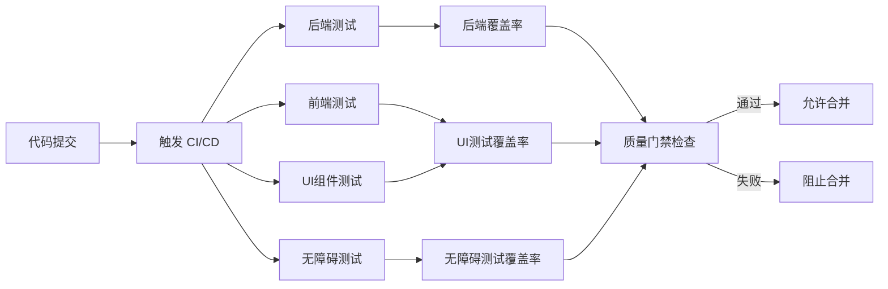

# 知识库智能体 - CI/CD配置文档

帅哥，本CI/CD配置文档详细介绍了如何配置自动化测试和部署流程，确保代码质量和系统稳定性。涵盖前后端测试、UI组件测试、无障碍测试以及质量门禁设置。

## 1. CI/CD架构概述



## 2. 后端CI/CD配置

### 2.1 GitHub Actions配置示例

在 `.github/workflows/backend-test.yml` 中配置后端测试：
```yaml
name: Backend Tests

on:
  push:
    branches: [ main, develop ]
  pull_request:
    branches: [ main, develop ]

jobs:
  test:
    runs-on: ubuntu-latest

    steps:
    - uses: actions/checkout@v4

    - name: Set up Python
      uses: actions/setup-python@v5
      with:
        python-version: '3.11'

    - name: Install UV
      run: |
        curl -LsSf https://astral.sh/uv/install.sh | sh

    - name: Install dependencies
      working-directory: ./code
      run: |
        uv sync

    - name: Run tests
      working-directory: ./code
      run: |
        uv run pytest --cov=app --cov-report=xml --cov-report=term-missing --maxWorkers=2 --testTimeout=10

    - name: Upload coverage to Codecov
      uses: codecov/codecov-action@v4
      with:
        file: ./code/coverage.xml
        flags: backend
        name: backend-coverage
```

### 2.2 后端测试执行流程

1. **环境准备**：安装 Python 3.11 和 UV 包管理器
2. **依赖安装**：使用 UV 同步项目依赖
3. **测试运行**：运行 pytest 并生成覆盖率报告
4. **覆盖率上传**：将覆盖率报告上传到 Codecov
5. **质量门禁**：检查覆盖率是否达到 95%

## 3. 前端CI/CD配置

### 3.1 GitHub Actions配置示例

在 `.github/workflows/frontend-test.yml` 中配置前端测试：
```yaml
name: Frontend Tests

on:
  push:
    branches: [ main, develop ]
  pull_request:
    branches: [ main, develop ]

jobs:
  test:
    runs-on: ubuntu-latest

    steps:
    - uses: actions/checkout@v4

    - name: Set up Node.js
      uses: actions/setup-node@v4
      with:
        node-version: '18'

    - name: Install pnpm
      run: npm install -g pnpm

    - name: Install dependencies
      working-directory: ./frontend
      run: pnpm install

    - name: Run tests
      working-directory: ./frontend
      run: pnpm test:coverage

    - name: Upload coverage to Codecov
      uses: codecov/codecov-action@v4
      with:
        file: ./frontend/coverage/coverage-final.json
        flags: frontend
        name: frontend-coverage

    - name: Run UI component tests
      working-directory: ./frontend
      run: pnpm test:ui

    - name: Run accessibility tests
      working-directory: ./frontend
      run: pnpm test:a11y
```

### 3.2 前端测试执行流程

1. **环境准备**：安装 Node.js 18 和 pnpm
2. **依赖安装**：使用 pnpm 安装项目依赖
3. **单元测试运行**：运行 Vitest 并生成覆盖率报告
4. **UI组件测试**：运行专门的UI组件测试
5. **无障碍测试**：运行无障碍测试
6. **覆盖率上传**：将覆盖率报告上传到 Codecov
7. **质量门禁**：检查覆盖率是否达到 80%

## 4. UI组件测试配置

帅哥，UI组件测试是确保界面美观、易用、专业的关键。

### 4.1 UI测试配置

在 `.github/workflows/ui-test.yml` 中配置UI组件测试：
```yaml
name: UI Component Tests

on:
  push:
    branches: [ main, develop ]
  pull_request:
    branches: [ main, develop ]

jobs:
  ui-tests:
    runs-on: ubuntu-latest

    steps:
    - uses: actions/checkout@v4

    - name: Set up Node.js
      uses: actions/setup-node@v4
      with:
        node-version: '18'

    - name: Install pnpm
      run: npm install -g pnpm

    - name: Install dependencies
      working-directory: ./frontend
      run: pnpm install

    - name: Install UI testing dependencies
      working-directory: ./frontend
      run: |
        pnpm add -D @playwright/test

    - name: Run UI component tests
      working-directory: ./frontend
      run: |
        pnpm test:ui -- --reporter=html

    - name: Upload UI test results
      uses: actions/upload-artifact@v4
      with:
        name: ui-test-results
        path: frontend/coverage
```

### 4.2 UI测试内容

**UI组件测试包含：**
- **样式测试**：验证玻璃拟态效果、渐变、阴影等UI设计元素
- **布局测试**：验证Bento Grid布局、响应式设计
- **交互测试**：验证按钮悬停、卡片悬停、输入框聚焦等微交互
- **动画测试**：验证淡入、滑入、脉冲等动画效果
- **主题测试**：验证深色/浅色主题切换
- **响应式测试**：验证不同屏幕尺寸的布局

## 5. 无障碍测试配置

帅哥，无障碍测试确保所有用户都能便捷使用界面。符合WCAG 2.1 AA级标准。

### 5.1 无障碍测试配置

在 `.github/workflows/a11y-test.yml` 中配置无障碍测试：
```yaml
name: Accessibility Tests

on:
  push:
    branches: [ main, develop ]
  pull_request:
    branches: [ main, develop ]

jobs:
  a11y-tests:
    runs-on: ubuntu-latest

    steps:
    - uses: actions/checkout@v4

    - name: Set up Node.js
      uses: actions/setup-node@v4
      with:
        node-version: '18'

    - name: Install pnpm
      run: npm install -g pnpm

    - name: Install dependencies
      working-directory: ./frontend
      run: pnpm install

    - name: Install accessibility testing dependencies
      working-directory: ./frontend
      run: |
        pnpm add -D @axe-core/playwright

    - name: Build frontend
      working-directory: ./frontend
      run: pnpm build

    - name: Run accessibility tests
      working-directory: ./frontend
      run: |
        pnpm test:a11y -- --reporter=html

    - name: Upload a11y test results
      uses: actions/upload-artifact@v4
      with:
        name: a11y-test-results
        path: frontend/coverage
```

### 5.2 无障碍测试内容

**无障碍测试包含：**
- **键盘导航测试**：验证Tab键顺序、焦点指示器
- **屏幕阅读器测试**：验证语义化HTML、ARIA标签
- **色彩对比度测试**：验证文字与背景对比度≥4.5:1
- **字体大小测试**：验证字体缩放支持
- **点击区域测试**：验证点击区域≥44x44px

## 6. 质量门禁配置

### 6.1 覆盖率要求

- **后端整体覆盖率**：> 95%
- **前端整体覆盖率**：> 80%
- **UI组件覆盖率**：> 85%
- **无障碍测试覆盖率**：> 90%
- **核心业务逻辑**：> 98%
- **API 层**：> 95%
- **组件覆盖率**：> 85%
- **Hooks 覆盖率**：> 90%
- **Stores 覆盖率**：> 90%
- **Services 覆盖率**：> 80%

### 6.2 Codecov配置

在项目根目录创建 `codecov.yml`：
```yaml
coverage:
  status:
    project:
      default:
        target: auto
        threshold: 1%
        informational: true
    patch:
      default:
        target: auto
        threshold: 1%
        informational: true

comment:
  layout: "reach,diff,flags,tree"
  behavior: default
  require_changes: false

ignore:
  - "frontend/src/test/**"
  - "frontend/src/**/*.test.ts"
  - "frontend/src/**/*.test.tsx"
  - "code/tests/**"
  - "**/*.d.ts"
```

## 7. 本地CI/CD模拟

### 7.1 使用 Act 运行 GitHub Actions

```bash
# 安装 act
winget install act-cli

# 运行后端测试 workflow
act push --job test -W .github/workflows/backend-test.yml

# 运行前端测试 workflow
act push --job test -W .github/workflows/frontend-test.yml
```

### 7.2 使用 Docker 运行测试

```bash
# 构建测试镜像
docker build -t knowledge-agentic-test -f Dockerfile.test .

# 运行后端测试
docker run --rm knowledge-agentic-test uv run pytest

# 运行前端测试
docker run --rm knowledge-agentic-test pnpm test
```

## 8. CI/CD最佳实践

### 8.1 测试优化

- **并行执行**：后端使用 `--maxWorkers=2` 并行运行测试
- **快速失败**：使用 `--bail` 在测试失败时立即停止
- **缓存依赖**：缓存 UV 和 pnpm 的依赖安装
- **增量测试**：只测试修改的文件（可选）

### 8.2 覆盖率优化

- **排除测试文件**：不计算测试文件的覆盖率
- **排除配置文件**：不计算配置文件的覆盖率
- **合并覆盖率**：将前后端覆盖率合并展示
- **趋势分析**：跟踪覆盖率变化趋势

### 8.3 通知与反馈

- **PR 注释**：在 Pull Request 中自动添加测试结果注释
- **失败通知**：测试失败时发送通知（邮件、Slack 等）
- **覆盖率徽章**：在 README 中显示覆盖率徽章
- **趋势报告**：定期生成覆盖率趋势报告

### 8.4 UI测试优化

帅哥，UI测试需要特别关注以下方面：

- **视觉回归测试**：使用Playwright或Cypress进行视觉快照对比
- **样式一致性测试**：验证所有页面使用统一的设计系统
- **响应式设计测试**：测试不同设备尺寸下的UI表现
- **主题切换测试**：验证深色/浅色主题的正确切换
- **动画性能测试**：验证动画帧率≥60fps

### 8.5 无障碍测试优化

- **自动化扫描**：使用axe-core或Pa11y进行自动化无障碍扫描
- **键盘导航测试**：验证所有交互元素都可以通过键盘访问
- **屏幕阅读器测试**：使用NVDA或VoiceOver测试屏幕阅读器兼容性
- **色彩对比度测试**：使用工具验证所有文本的对比度

## 9. CI/CD故障排查

### 9.1 测试超时

- **问题**：测试运行超时
- **解决**：
  1. 检查测试是否有死循环
  2. 增加超时时间配置
  3. 优化测试性能

### 9.2 依赖安装失败

- **问题**：依赖安装失败
- **解决**：
  1. 检查依赖版本是否兼容
  2. 清除缓存重新安装
  3. 检查网络连接

### 9.3 覆盖率不达标

- **问题**：覆盖率低于要求
- **解决**：
  1. 查看覆盖率报告，找到未覆盖的代码
  2. 编写测试用例覆盖这些代码
  3. 优化测试策略

### 9.4 UI测试失败

- **问题**：UI测试失败（样式、布局等）
- **解决**：
  1. 检查测试是否正确选择UI元素
  2. 验证CSS是否正确加载
  3. 检查设计系统是否正确应用

### 9.5 无障碍测试失败

- **问题**：无障碍测试失败
- **解决**：
  1. 检查ARIA标签是否正确
  2. 验证语义化HTML标签
  3. 检查色彩对比度是否达标

## 10. 相关文档

- [测试指南文档](./测试指南.md) - 学习测试编写和执行
- [测试方案文档](./测试方案.md) - 了解测试策略
- [部署说明文档](./部署说明.md) - 了解部署步骤
- [技术设计文档](./技术设计.md) - 了解系统架构
- [操作界面文档](./操作界面.md) - 了解前端界面设计

希望这份CI/CD配置文档能帮助你配置自动化测试和部署！
