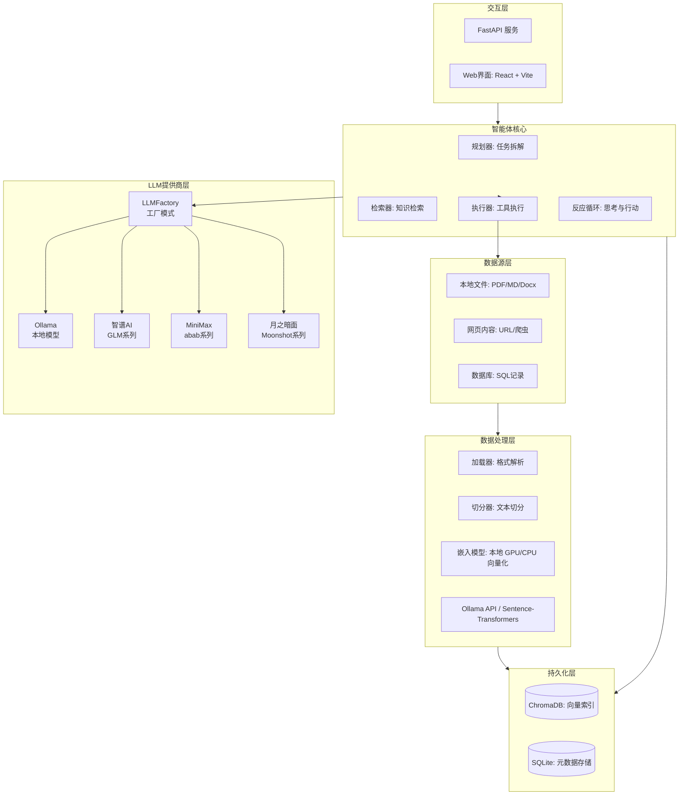
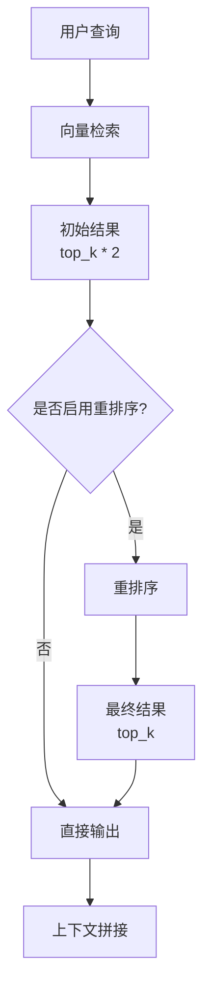
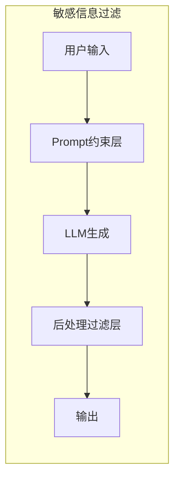
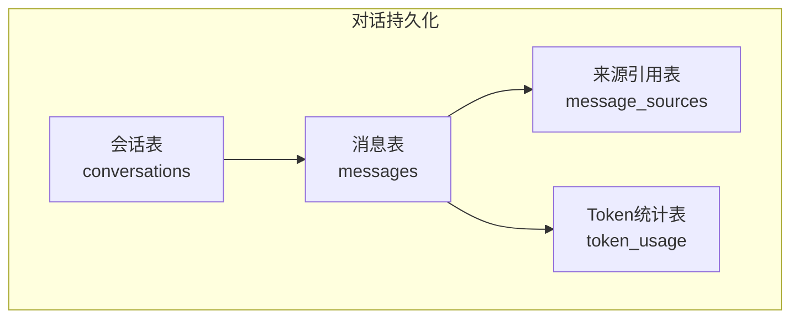
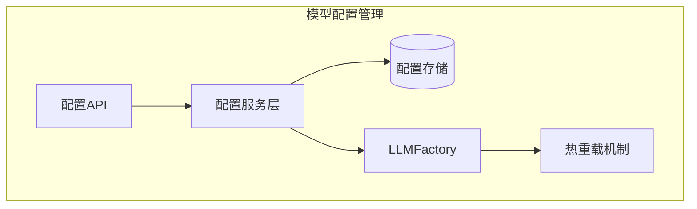
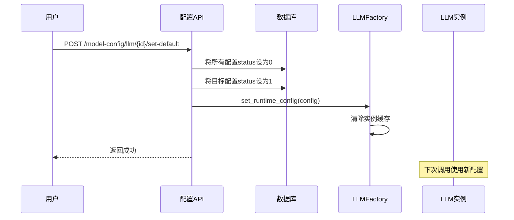
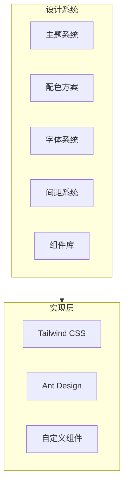

# 知识库智能体 - 技术设计文档

## 1. 总体架构

帅哥，本项目遵循模块化和单一职责原则设计。核心流程包括：数据摄入、向量化存储、检索、推理以及智能体任务流调度。



## 2. 技术栈选型

### 2.1 后端技术栈
- **后端框架**：FastAPI（高性能、异步、类型安全）
- **AI 编排**：LangGraph 和 LangChain（处理复杂的循环任务流和状态管理）
- **多LLM提供商支持**：
  - **Ollama**：本地模型推理（运行 Llama 3、DeepSeek-R1 等）
  - **智谱AI**：云端GLM系列模型（glm-4、glm-3-turbo 等）
  - **MiniMax**：云端abab系列模型（abab5.5-chat、abab5.5s-chat 等）
  - **月之暗面**：云端Moonshot系列模型（moonshot-v1-8k、moonshot-v1-32k 等）
  - **工厂模式**：使用LLMFactory统一管理，支持通过配置文件动态切换
- **向量数据库**：ChromaDB（本地轻量级持久化存储）
- **文档解析**：Unstructured.io（强大的混合格式处理能力）
- **开发语言**：Python 3.10+

### 2.2 前端技术栈

#### 核心框架
- **前端框架**：React 18.3.1（函数式组件 + Hooks）
- **构建工具**：Vite 7+（快速开发，热更新）
- **包管理器**：pnpm（高效、节省磁盘空间）
- **路由管理**：React Router v7
- **状态管理**：Zustand（轻量级、简单易用）
- **HTTP 客户端**：axios（请求拦截、响应拦截）

#### UI/UX设计系统

**基于UI/UX Pro Max设计理念，采用现代UI/UX最佳实践：**

- **UI组件库**：Ant Design 6+（企业级组件，主题定制）
  - 定制主题：深色模式、玻璃拟态效果
  - 组件样式：渐变按钮、卡片阴影、边框光效

- **样式方案**：CSS Modules + Tailwind CSS（按需加载）
  - 响应式设计：移动端优先，断点适配（640px、768px、1024px、1280px）
  - 主题系统：基于CSS变量的主题切换
  - 动画系统：过渡、缓动、关键帧动画

- **设计风格**：
  - **玻璃拟态（Glassmorphism）**：半透明背景、模糊效果、边框光效
  - **深色模式（Dark Mode）**：深色背景、浅色文字、高对比度
  - **Bento Grid布局**：网格化卡片、响应式排列、信息层次清晰
  - **渐变美学**：蓝紫渐变（#667eea → #764ba2）作为主色调

- **字体系统**（Google Fonts）：
  - 标题字体：Inter（现代、清晰）
  - 正文字体：Inter（统一风格）
  - 代码字体：JetBrains Mono（等宽、易读）

- **间距系统**：
  - 基础单位：4px
  - 间距规范：8px（sm）、16px（md）、24px（lg）、32px（xl）、48px（2xl）

- **无障碍设计（Accessibility）**：
  - 符合WCAG 2.1标准
  - 键盘导航支持
  - 屏幕阅读器友好
  - 色彩对比度符合AA级别
  - 焦点指示器清晰可见

- **动画与过渡**：
  - 过渡时间：150ms（快）、300ms（中）、500ms（慢）
  - 缓动函数：cubic-bezier(0.4, 0, 0.2, 1)
  - 常用动画：淡入（fadeIn）、滑入（slideIn）、脉冲（pulse）

## 3. 核心模块设计

### 3.1 数据摄入模块
- **解析逻辑**：使用 `Unstructured` 库对不同格式文档进行结构化提取。
- **切分策略**：采用递归字符文本切分器，设置合理的块大小（如 1000 字符）和重叠（如 200 字符），以保持上下文连贯性。
- **向量化**：支持双模驱动：
    - **API 模式**：通过 Ollama 提供的 `mxbai-embed-large` 或 `nomic-embed-text` 模型。
    - **本地 GPU 模式**：使用 `Sentence-Transformers` 直接加载模型（如 `BAAI/bge-large-zh-v1.5`）并运行在 CUDA 设备上，显著提升处理大批量数据的吞吐量。

### 3.2 检索引擎模块

帅哥，检索引擎模块负责基于向量库的语义检索，并支持轻量级重排序以提升检索准确率。

**架构设计：**



**检索策略**：

- **相似度搜索**：使用ChromaDB进行向量相似度检索，获取前K个最相关的片段
- **重排序**：可选步骤，通过更高精度模型对初始结果进行排序

#### 重排序功能

系统支持基于Embedding模型的轻量级重排序，提升检索准确率：

| 配置项 | 说明 |
|--------|------|
| ENABLE_RERANKING | 是否启用重排序（.env配置） |
| 触发条件 | 仅本地embedding提供商（ollama/local）时启用 |

**重排序流程**：

1. 执行初始向量检索，获取 `top_k * 2` 个候选结果
2. 使用embedding模型计算query与每个document的余弦相似度
3. 按相似度重新排序，返回top_k个结果
4. 云端embedding提供商不启用重排序（避免本地模型对云端结果重排）

**重排序算法**：

```python
# 余弦相似度计算
similarity = (query_vector · doc_vector) / (||query_vector|| × ||doc_vector||)

# 分数归一化到0-1范围
normalized_score = (score - min_score) / (max_score - min_score)
```

**相关代码**：
- 服务层：`app/services/search_service.py`
- 重排序方法：`SearchService._rerank_with_embeddings()`

**上下文拼接**：将检索出的片段与用户原始问题组合，并注入提示词模板。

### 3.3 智能体决策模块
- **技术框架**：使用 LangGraph 维护复杂的反应循环。
- **状态管理**：通过 `AgentState` 记录对话历史（`messages`）和检索来源（`sources`）。
- **执行逻辑**：
    1. **智能体节点**：接收消息，由模型决定是直接回复还是调用工具。
    2. **是否继续判定**：检查模型是否生成了 `tool_calls`。
    3. **动作节点**：使用 `ToolExecutor` 执行工具调用（如 `retrieve_knowledge`、`search_local_files`、`calculate`、`query_metadata_db`）。
    4. **循环逻辑**：工具执行完毕后反馈给智能体，直至生成最终回答。

### 3.4 敏感信息过滤模块

帅哥，敏感信息过滤模块用于保护用户隐私，在AI回复中自动识别和脱敏敏感信息。

**架构设计：**



**核心组件：**

| 组件 | 文件位置 | 说明 |
|------|----------|------|
| SensitiveDataFilter | `app/utils/sensitive_data_filter.py` | 核心过滤器类 |
| StreamingSensitiveFilter | `app/utils/sensitive_data_filter.py` | 流式过滤器 |
| 配置项 | `app/core/config.py` | 过滤开关和策略 |

**过滤流程：**

1. **Prompt约束层**：在系统提示词中明确约束，禁止输出敏感信息
2. **后处理过滤层**：使用正则表达式精确匹配并替换敏感信息
3. **支持类型**：
   - 手机号：中国大陆手机号（11位，1开头）
   - 邮箱：标准邮箱地址格式

**脱敏策略：**

| 策略 | 效果示例 |
|------|----------|
| full | `13812345678` → `[已隐藏手机号]` |
| partial | `13812345678` → `138****5678` |
| hash | `13812345678` → `[手机号:1234]` |

**配置方式：**

```bash
# .env 配置
ENABLE_SENSITIVE_DATA_FILTER=True
SENSITIVE_DATA_MASK_STRATEGY=full
FILTER_MOBILE=True
FILTER_EMAIL=True
```

**流式输出处理：**

- 使用滑动窗口缓冲方案（默认20字符）
- 处理跨chunk的敏感信息检测
- 在流结束时flush剩余缓冲区内容

### 3.5 对话持久化模块

帅哥，对话持久化模块支持多会话管理和历史记录功能，实现完整的对话系统。

**架构设计：**



#### 数据模型设计

**会话表 (conversations)**

| 字段 | 类型 | 约束 | 说明 |
|------|------|------|------|
| id | Integer | PRIMARY KEY | 会话ID |
| title | String(255) | NOT NULL | 会话标题 |
| model_name | String(100) | NULLABLE | 使用的模型名称 |
| use_agent | Integer | DEFAULT 0 | 是否启用智能体(0/1) |
| total_tokens | Integer | DEFAULT 0 | 总Token消耗 |
| total_cost | Numeric(10,4) | DEFAULT 0 | 总成本（元） |
| message_count | Integer | DEFAULT 0 | 消息数量（缓存字段） |
| created_at | DateTime | NOT NULL | 创建时间 |
| updated_at | DateTime | NOT NULL | 更新时间 |

**索引**：`idx_updated_at(updated_at)` - 支持按更新时间倒序查询

**消息表 (messages)**

| 字段 | 类型 | 约束 | 说明 |
|------|------|------|------|
| id | Integer | PRIMARY KEY | 消息ID |
| conversation_id | Integer | FOREIGN KEY | 关联会话ID（级联删除） |
| role | Enum | NOT NULL | 消息角色(user/assistant/system) |
| content | Text | NOT NULL | 消息内容 |
| streaming_state | String(20) | NULLABLE | 流式状态(idle/streaming/completed) |
| tokens_count | Integer | DEFAULT 0 | Token数量 |
| created_at | DateTime | NOT NULL | 创建时间 |

**外键约束**：`fk_message_conversation(conversation_id) REFERENCES conversations(id) ON DELETE CASCADE`

**索引**：`idx_conversation_created(conversation_id, created_at)` - 支持按会话查询消息并按时间排序

**来源引用表 (message_sources)**

| 字段 | 类型 | 约束 | 说明 |
|------|------|------|------|
| id | Integer | PRIMARY KEY | 来源ID |
| message_id | Integer | FOREIGN KEY | 关联消息ID（级联删除） |
| document_id | Integer | FOREIGN KEY | 引用文档ID（置空删除） |
| chunk_id | String(100) | NULLABLE | 文档片段ID |
| file_name | String(255) | NOT NULL | 文件名（冗余存储，提升查询性能） |
| text_segment | Text | NOT NULL | 引用的文本片段 |
| score | Integer | NULLABLE | 相关系评分(0-100) |
| position | Integer | DEFAULT 0 | 排序位置 |

**外键约束**：
- `fk_source_message(message_id) REFERENCES messages(id) ON DELETE CASCADE`
- `fk_source_document(document_id) REFERENCES documents(id) ON DELETE SET NULL`

**索引**：`idx_message_position(message_id, position)` - 支持按消息查询来源并按位置排序

**Token统计表 (token_usage)**

| 字段 | 类型 | 约束 | 说明 |
|------|------|------|------|
| id | Integer | PRIMARY KEY | Token记录ID |
| conversation_id | Integer | FOREIGN KEY | 关联会话ID（级联删除） |
| message_id | Integer | FOREIGN KEY | 关联消息ID（级联删除） |
| model_name | String(100) | NOT NULL | 模型名称 |
| prompt_tokens | Integer | DEFAULT 0 | 输入Token数 |
| completion_tokens | Integer | DEFAULT 0 | 输出Token数 |
| total_tokens | Integer | DEFAULT 0 | 总Token数 |
| prompt_cost | Numeric(10,6) | DEFAULT 0 | 输入成本（元） |
| completion_cost | Numeric(10,6) | DEFAULT 0 | 输出成本（元） |
| total_cost | Numeric(10,6) | DEFAULT 0 | 总成本（元） |
| created_at | DateTime | NOT NULL | 创建时间 |

**外键约束**：
- `fk_token_conversation(conversation_id) REFERENCES conversations(id) ON DELETE CASCADE`
- `fk_token_message(message_id) REFERENCES messages(id) ON DELETE CASCADE`

**索引**：
- `idx_conversation_token(conversation_id)` - 支持按会话查询Token统计
- `idx_message_token(message_id)` - 支持按消息查询Token记录

#### 核心功能

**会话管理**：
- 创建会话：自动生成标题或用户自定义
- 查询会话列表：按更新时间倒序，支持分页
- 更新会话：修改标题、模型等属性
- 删除会话：级联删除关联的消息、来源和Token记录

**消息持久化**：
- 保存用户和助手消息
- 支持流式输出状态跟踪
- 自动更新会话的`updated_at`时间戳

**来源追踪**：
- 记录RAG检索的文档来源
- 关联文档ID和向量库中的chunk_id
- 按相关度评分排序

**Token统计**：
- 记录每次LLM调用的Token消耗
- 支持按会话和消息维度统计成本
- 使用`app/core/token_pricing.py`计算成本

### 3.6 模型配置管理模块

帅哥，模型配置管理模块支持动态配置多个LLM和Embedding提供商，无需重启服务即可切换模型。

**架构设计：**



#### 数据模型设计

**LLM配置表 (model_config)**

| 字段 | 类型 | 约束 | 说明 |
|------|------|------|------|
| id | String(50) | PRIMARY KEY | 配置ID（使用UUID） |
| provider_id | String(50) | NOT NULL | 提供商ID(ollama/zhipuai/openai等) |
| provider_name | String(100) | NOT NULL | 提供商名称 |
| endpoint | String(500) | NOT NULL | API端点地址 |
| api_key | String(500) | NULLABLE | API密钥 |
| model_id | String(100) | NOT NULL | 模型ID |
| model_name | String(100) | NOT NULL | 模型名称 |
| type | String(20) | DEFAULT 'text' | 模型类型(text/embedding) |
| temperature | Float | DEFAULT 0.7 | 温度参数(0-2) |
| max_tokens | Integer | DEFAULT 8192 | 最大token数 |
| top_p | Float | DEFAULT 0.9 | nucleus采样参数 |
| top_k | Integer | DEFAULT 0 | top-k采样参数 |
| status | Integer | DEFAULT 0 | 状态(1启用使用中/0禁用) |
| created_at | DateTime | NULLABLE | 创建时间 |
| updated_at | DateTime | NULLABLE | 更新时间 |

**唯一约束**：`uq_model_config_provider_model_type(provider_id, model_id, type)` - 防止重复配置

**索引**：
- `idx_model_config_provider(provider_id)`
- `idx_model_config_status(status)`

**Embedding配置表 (embedding_config)**

| 字段 | 类型 | 约束 | 说明 |
|------|------|------|------|
| id | String(50) | PRIMARY KEY | 配置ID |
| provider_id | String(50) | NOT NULL | 提供商ID |
| provider_name | String(100) | NOT NULL | 提供商名称 |
| endpoint | String(500) | NULLABLE | API端点地址 |
| api_key | String(500) | NULLABLE | API密钥 |
| model_id | String(100) | NOT NULL | 模型ID |
| model_name | String(100) | NOT NULL | 模型名称 |
| device | String(20) | DEFAULT 'cpu' | 运行设备(cpu/cuda/auto) |
| status | Integer | DEFAULT 0 | 状态(1启用/0禁用) |
| created_at | DateTime | NULLABLE | 创建时间 |
| updated_at | DateTime | NULLABLE | 更新时间 |

**唯一约束**：`uq_embedding_config_provider_model(provider_id, model_id)` - 防止重复配置

**索引**：`idx_embedding_config_provider(provider_id)`

#### 配置热切换机制

系统支持配置热切换，无需重启服务即可切换LLM和Embedding模型：



**热切换流程**：

1. 用户调用 `/model-config/llm/{id}/set-default`
2. 服务将所有配置的`status`设为0，目标配置设为1
3. 调用 `LLMFactory.set_runtime_config()` 更新运行时配置
4. 清除现有实例缓存
5. 下次LLM调用时自动使用新配置

**相关代码**：
- 服务层：`app/services/model_config_service.py`
- 热重载方法：`ModelConfigService._reload_config()`
- 工厂类：`app/utils/llm_factory.py`

#### 支持的提供商

| 提供商 | provider_id | 默认模型 | 说明 |
|--------|-------------|----------|------|
| Ollama | ollama | deepseek-r1:8b | 本地模型推理 |
| 智谱AI | zhipuai | glm-4-flash | GLM系列模型 |
| OpenAI | openai | gpt-4o-mini | GPT系列模型 |
| MiniMax | minimax | abab5.5-chat | abab系列模型 |
| 月之暗面 | moonshot | moonshot-v1-8k | Moonshot系列模型 |

#### 自动初始化

首次访问API时，系统自动初始化默认配置：

```python
# 默认配置列表来自 app/core/llm_constants.py
DEFAULT_LLM_PROVIDERS = [
    {"id": "ollama", "name": "Ollama", "default_models": ["deepseek-r1:8b"]},
    {"id": "zhipuai", "name": "智谱AI", "default_models": ["glm-4-flash"]},
    # ...
]
```

**初始化规则**：
- 创建所有提供商的默认配置
- 只有一个配置的`status`设为1（默认Ollama）
- 利用唯一约束防止重复初始化

## 4. 数据库设计（元数据）

系统在 `SQLite` 中维护元数据信息，以支持增量同步和溯源：

### 4.1 文档表
- **id**：主键，唯一标识
- **file_name**：文件名
- **file_path**：文件原始路径或来源 URL
- **file_hash**：文件内容哈希，用于检测更新
- **source_type**：来源类型（文件、网页、数据库）
- **created_at**：摄入时间

### 4.2 向量索引映射
- **id**：主键
- **document_id**：关联文档 ID
- **chunk_id**：向量库中的块 ID
- **chunk_content**：片段文本内容备份

### 4.3 对话持久化表

帅哥，对话持久化表支持多会话管理和历史记录，详细设计见 [3.5 对话持久化模块](#35-对话持久化模块)。

**表结构概览**：
- `conversations` - 会话表
- `messages` - 消息表
- `message_sources` - 来源引用表
- `token_usage` - Token统计表

### 4.4 模型配置表

帅哥，模型配置表支持动态管理多个LLM和Embedding提供商，详细设计见 [3.6 模型配置管理模块](#36-模型配置管理模块)。

**表结构概览**：
- `model_config` - LLM模型配置表
- `embedding_config` - Embedding模型配置表

### 4.5 任务表

- **id**：主键，唯一标识
- **task_id**：任务UUID
- **file_name**：文件名
- **status**：任务状态（pending/processing/completed/failed）
- **progress**：处理进度（0-100）
- **error_message**：错误信息（失败时记录）
- **created_at**：创建时间

## 5. 接口设计

### 5.1 知识管理接口
- `POST /v1/ingest/file`：上传并解析文件
- `POST /v1/ingest/url`：抓取并解析网页内容
- `GET /v1/documents`：获取已摄入的文档列表

### 5.2 智能问答接口
- `POST /v1/chat/completions`：流式或非流式对话接口，支持配置是否启用智能体模式。
- `GET /v1/sources`：查询特定回答的引用来源详情。

### 5.3 响应式设计考虑

**在接口设计中，充分考虑前端响应式展示需求：**

- **分页参数**：支持分页查询，便于前端实现虚拟滚动和懒加载
- **数据结构**：返回的数据结构符合前端组件化设计需求
- **字段冗余**：提供前端渲染所需的所有字段，减少额外请求
- **错误处理**：返回详细的错误信息，便于前端展示友好提示

## 6. 前端设计系统

### 6.1 设计系统架构



### 6.2 主题系统

**支持主题切换和自定义：**

- **深色主题**：默认主题，深色背景（#0f172a），浅色文字
- **浅色主题**：可选主题，浅色背景，深色文字
- **主题切换**：基于CSS变量，实时切换，无需刷新
- **主题持久化**：用户偏好存储在localStorage中

### 6.3 组件设计原则

**遵循UI/UX Pro Max的组件设计原则：**

- **一致性**：所有组件遵循统一的设计规范
- **可复用性**：组件独立，可在多处复用
- **可组合性**：组件可以嵌套组合，构建复杂界面
- **可访问性**：组件符合无障碍设计标准
- **响应式**：组件适配不同屏幕尺寸

### 6.4 Bento Grid布局

**采用Bento Grid卡片布局，信息层次清晰：**

```
┌─────────────────────────────────────────┐
│  Header（顶部导航栏）                 │
├────────────┬──────────────────────────┤
│            │                         │
│  Sidebar   │   Main Content         │
│  （侧边栏） │   （主内容区）         │
│            │   ┌────────┬────────┐ │
│            │   │ 卡片1  │ 卡片2  │ │
│            │   ├────────┼────────┤ │
│            │   │ 卡片3  │ 卡片4  │ │
│            │   └────────┴────────┘ │
└────────────┴──────────────────────────┘
```

**Bento Grid特点：**
- 网格化卡片布局
- 响应式排列
- 卡片可合并和拆分
- 信息层次清晰
- 美观大方

### 6.5 无障碍设计（Accessibility）

**确保所有用户都能便捷使用：**

#### 6.5.1 键盘导航
- 所有交互元素支持键盘操作
- Tab键顺序合理
- 焦点指示器清晰可见

#### 6.5.2 屏幕阅读器
- 使用语义化HTML标签
- 添加ARIA标签
- 图标添加aria-label

#### 6.5.3 色彩对比度
- 符合WCAG 2.1 AA级别
- 文字与背景对比度至少4.5:1
- 大文字对比度至少3:1

#### 6.5.4 其他
- 支持字体缩放
- 提供足够的点击区域（至少44x44px）
- 避免仅使用颜色传达信息

## 7. 测试架构概述

帅哥，本项目采用分层测试架构，确保代码质量和系统稳定性。测试架构分为后端测试和前端测试两大部分，各自采用不同的测试框架和工具链。

详细的测试架构设计、测试工具链、测试目录结构、测试覆盖率目标、测试执行策略、测试最佳实践等内容，请参考 [测试指南文档](./测试指南.md)。

## 8. 性能优化

### 8.1 前端性能优化

**采用多种性能优化策略：**

- **代码分割**：使用React.lazy和Suspense进行代码分割
- **虚拟滚动**：长列表使用虚拟滚动，减少DOM节点
- **图片优化**：懒加载、WebP格式、响应式图片
- **缓存策略**：HTTP缓存、localStorage缓存、内存缓存
- **渲染优化**：使用useMemo、useCallback避免不必要的渲染
- **打包优化**：Tree shaking、压缩、CDN加速

### 8.2 用户体验优化

**提升用户体验的关键措施：**

- **加载状态**：显示加载动画，告知用户进度
- **错误提示**：友好的错误信息，提供解决方案
- **操作反馈**：每个操作都有明确的视觉反馈
- **撤销重做**：支持撤销和重做操作
- **快捷键**：提供常用快捷键，提高操作效率
- **平滑过渡**：动画过渡，提升交互体验

## 9. 相关文档

- [需求规格说明书](./需求规格说明书.md) - 了解项目需求
- [API接口文档](./API接口文档.md) - 查看接口详细说明
- [测试方案文档](./测试方案.md) - 了解测试策略
- [测试指南文档](./测试指南.md) - 学习测试编写和执行
- [CI/CD配置文档](./CI-CD配置文档.md) - 配置自动化测试和部署
- [操作界面文档](./操作界面.md) - 了解前端界面设计
- [敏感信息过滤文档](./sensitive-data-filter.md) - 了解敏感信息过滤功能
