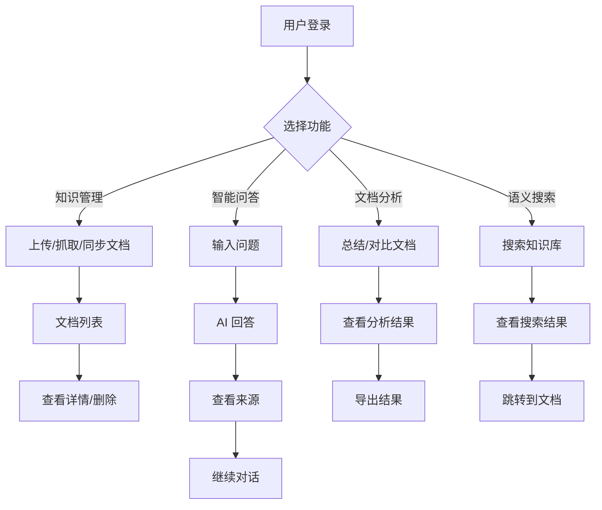

# 知识库智能体 - 操作界面文档

## 1. 界面设计概述

### 1.1 设计理念

帅哥，本操作界面遵循"简洁、高效、隐私优先"的设计理念，采用 **UI/UX Pro Max** 设计体系，融合现代UI/UX最佳实践，为用户提供优雅、直观的知识管理和智能问答体验。

#### 核心设计原则

- **简洁性**：界面布局清晰，操作流程简单，降低用户学习成本
- **高效性**：快速响应，流畅交互，支持流式输出
- **隐私优先**：所有数据处理在本地完成，界面明确提示数据安全状态
- **可扩展性**：模块化设计，便于后续功能扩展

#### UI/UX Pro Max设计理念

**本界面采用UI/UX Pro Max设计体系的现代UI风格：**

| 设计风格 | 特性描述 | 应用场景 |
|---------|---------|---------|
| **玻璃拟态**（Glassmorphism） | 半透明背景、模糊效果、边框光效 | 卡片、对话框、下拉菜单 |
| **深色模式**（Dark Mode） | 深色背景、浅色文字、高对比度 | 整体主题、默认界面 |
| **Bento Grid布局** | 网格化卡片、响应式排列 | 主内容区、信息展示 |
| **渐变美学** | 蓝紫渐变、悬停过渡 | 按钮、高亮元素、品牌标识 |
| **微交互** | 细腻动画、即时反馈 | 按钮悬停、加载状态 |

### 1.2 设计系统

#### 1.2.1 配色方案

**基于蓝紫渐变的深色主题配色系统：**

| 色系 | 颜色值 | CSS变量 | 用途说明 |
|-----|-------|---------|---------|
| **主色调** | #667eea → #764ba2 | --primary-gradient | 渐变按钮、高亮元素 |
| **主色起始** | #667eea | --primary-500 | 按钮、链接 |
| **主色结束** | #764ba2 | --primary-900 | 渐变结束色 |
| **背景色** | #0f172a | --bg-default | 页面背景 |
| **卡片背景** | #1e293b | --bg-card | 内容容器 |
| **卡片悬停** | #334155 | --bg-card-hover | 卡片悬停状态 |
| **输入框背景** | #1e293b | --bg-input | 输入控件 |
| **主要文字** | #f1f5f9 | --text-primary | 标题、重要信息 |
| **次要文字** | #cbd5e1 | --text-secondary | 正文内容 |
| **辅助文字** | #94a3b8 | --text-muted | 提示信息 |
| **禁用文字** | #64748b | --text-disabled | 禁用状态 |
| **边框色** | #334155 | --border-default | 默认边框 |
| **边框浅色** | #475569 | --border-light | 次要边框 |
| **焦点边框** | #667eea | --border-focus | 焦点状态 |
| **玻璃态浅** | rgba(255, 255, 255, 0.05) | --glass-light | 半透明背景 |
| **玻璃态中** | rgba(255, 255, 255, 0.1) | --glass-medium | 较明显透明 |
| **玻璃态暗** | rgba(0, 0, 0, 0.3) | --glass-dark | 遮罩层 |

#### 1.2.2 字体系统

**采用Google Fonts的专业字体配对：**

| 用途 | 字体 | 字重 | 应用场景 |
|-----|------|------|---------|
| **大标题** | Inter | 700 (Bold) | 页面标题、Logo |
| **中标题** | Inter | 600 (SemiBold) | 区块标题、卡片标题 |
| **小标题** | Inter | 500 (Medium) | 子标题、标签 |
| **正文** | Inter | 400 (Regular) | 文章内容、说明文字 |
| **辅助文字** | Inter | 300 (Light) | 提示信息、元数据 |
| **代码** | JetBrains Mono | 400 (Regular) | 代码片段、终端输出 |

**Google Fonts引入：**
```html
<link rel="preconnect" href="https://fonts.googleapis.com">
<link rel="preconnect" href="https://fonts.gstatic.com" crossorigin>
<link href="https://fonts.googleapis.com/css2?family=Inter:wght@300;400;500;600;700&family=JetBrains+Mono:wght@400&display=swap" rel="stylesheet">
```

#### 1.2.3 间距系统

**基于4px基础单位的间距规范：**

| 间距变量 | 值 | 应用场景 |
|---------|---|---------|
| --space-1 | 4px | 紧凑间距 |
| --space-2 | 8px | 小间距（sm） |
| --space-3 | 12px | 内部间距 |
| --space-4 | 16px | 中间距（md） |
| --space-6 | 24px | 大间距（lg） |
| --space-8 | 32px | 超大间距（xl） |
| --space-12 | 48px | 区块间距（2xl） |

#### 1.2.4 阴影与光效

**玻璃拟态效果的阴影和光效：**

| 阴影类型 | CSS值 | 应用场景 |
|---------|-------|---------|
| **卡片阴影** | 0 8px 32px rgba(0, 0, 0, 0.4) | 普通卡片 |
| **光晕效果** | 0 0 20px rgba(102, 126, 234, 0.4) | 高亮元素 |
| **大光晕** | 0 0 40px rgba(102, 126, 234, 0.6) | 强调元素 |
| **玻璃态阴影** | 0 8px 32px 0 rgba(0, 0, 0, 0.3) | 玻璃态卡片 |

#### 1.2.5 动画系统

**流畅的过渡和动画效果：**

| 动画类型 | 持续时间 | 缓动函数 | 应用场景 |
|---------|---------|---------|---------|
| **快速过渡** | 150ms | ease-out | 悬停、点击反馈 |
| **标准过渡** | 300ms | cubic-bezier(0.4, 0, 0.2, 1) | 页面切换、模态框 |
| **慢速过渡** | 500ms | ease-in-out | 进场动画 |
| **淡入** | 300ms | ease-out | 内容显示 |
| **滑入** | 300ms | cubic-bezier(0.4, 0, 0.2, 1) | 列表加载 |
| **脉冲** | 2s | ease-in-out | 加载指示器 |

**关键帧动画定义：**
```css
@keyframes fadeIn {
  from { opacity: 0; }
  to { opacity: 1; }
}

@keyframes slideIn {
  from {
    opacity: 0;
    transform: translateY(20px);
  }
  to {
    opacity: 1;
    transform: translateY(0);
  }
}

@keyframes float {
  0%, 100% { transform: translateY(0); }
  50% { transform: translateY(-10px); }
}
```

#### 1.2.6 Bento Grid布局

**网格化卡片布局系统：**

```
┌─────────────────────────────────────────────────────┐
│  Header（顶部导航栏，高度64px）                    │
├────────────┬──────────────────────────────────────┤
│            │                                      │
│  Sidebar   │   Main Content Area（Bento Grid）      │
│  （240px）  │   ┌────────┬────────┬────────┐      │
│            │   │ 卡片1  │ 卡片2  │ 卡片3  │      │
│  导航菜单   │   │ (大)   │ (中)   │ (小)   │      │
│            │   ├────────┼────────┼────────┤      │
│  • 知识管理 │   │ 卡片4  │ 卡片5  │ 卡片6  │      │
│  • 智能问答 │   │ (中)   │ (小)   │ (小)   │      │
│  • 文档分析 │   └────────┴────────┴────────┘      │
│  • 语义搜索 │   响应式排列，卡片可合并和拆分        │
│            │                                      │
└────────────┴──────────────────────────────────────┘
```

**Bento Grid特点：**
- 网格化布局，12列系统
- 响应式排列，自动适配屏幕
- 卡片可合并（跨列、跨行）
- 信息层次清晰
- 视觉美观大方

**响应式断点：**
- **移动端**（<640px）：单列布局
- **平板**（640px-1024px）：2-3列布局
- **桌面**（>1024px）：3-4列布局

### 1.3 无障碍设计（Accessibility）

**符合WCAG 2.1 AA级标准，确保所有用户都能便捷使用：**

#### 1.3.1 键盘导航
- 所有交互元素支持键盘操作（Tab、Enter、Escape）
- Tab键顺序符合逻辑（从左到右、从上到下）
- 焦点指示器清晰可见（2px蓝色边框）
- 支持快捷键操作（Ctrl+K搜索、Ctrl+/帮助）

#### 1.3.2 屏幕阅读器
- 使用语义化HTML标签（nav、main、section、article）
- 添加ARIA标签（aria-label、aria-describedby）
- 图标添加aria-label说明
- 状态变化通过aria-live通知

#### 1.3.3 色彩对比度
- 文字与背景对比度至少4.5:1（AA级）
- 大文字（18px+）对比度至少3:1（AA级）
- 不仅使用颜色传达信息，配合图标或文字

#### 1.3.4 其他无障碍特性
- 支持字体缩放（100%-200%）
- 提供足够的点击区域（至少44x44px）
- 避免自动播放媒体（用户控制播放）
- 提供跳过导航链接

### 1.4 界面架构布局

界面采用经典的左右分栏布局，结合Bento Grid卡片系统：

```
┌─────────────────────────────────────────────────────────────┐
│  顶部导航栏（Header）                                 │
│  Logo | 知识管理 | 智能问答 | 文档分析 | 设置      │
│  高度: 64px | 背景: 深色渐变 | 玻璃态效果          │
├─────────────────────────────────────────────────────────────┤
│  左侧边栏（Sidebar）           │  主内容区（Main Content）│
│  宽度: 240px（桌面）        │  ┌──────────────────┐  │
│  背景: 深色                 │  │  Bento Grid布局   │  │
│  可折叠                      │  │  ┌────┬────┐    │  │
│                              │  │  │ 卡1│ 卡2│    │  │
│  导航菜单                     │  │  ├────┼────┤    │  │
│  • 知识库管理                 │  │  │ 卡3│ 卡4│    │  │
│    ├─ 文件上传               │  │  └────┴────┘    │  │
│    ├─ 网页抓取               │  │  网格化排列       │  │
│    ├─ 数据库同步             │  └──────────────────┘  │
│    └─ 文档列表               │                      │
│  • 语义搜索                  │  对话界面 / 文档列表 / │
│  • 历史记录                  │  搜索结果 / 分析结果   │
│                              │                      │
└─────────────────────────────────────────────────────────────┘
```

### 1.5 技术选型

- **前端框架**：React 18.3.1（函数式组件 + Hooks）
- **构建工具**：Vite 7+（快速开发，热更新）
- **包管理器**：pnpm（高效、节省磁盘空间）
- **路由管理**：React Router v7
- **状态管理**：Zustand（轻量级、简单易用）
- **HTTP 客户端**：axios（请求拦截、响应拦截）
- **UI 组件库**：Ant Design 6+（企业级组件，主题定制）
- **样式方案**：CSS Modules + Tailwind CSS（按需加载）
- **代码规范**：ESLint + Prettier
- **类型检查**：TypeScript 5+

## 2. 界面功能模块

### 2.1 知识管理模块

#### 2.1.1 文件上传
**功能描述**：支持拖拽上传或点击选择本地文件，自动解析并向量化存储。

**界面元素**：
- 上传区域（支持拖拽，玻璃态卡片）
- 文件类型提示（PDF、MD、DOCX、TXT、Excel）
- 上传进度条（渐变色，带光晕效果）
- 上传状态提示（处理中/已完成/失败，带图标）
- 标签输入框（可选，标签式输入）

**设计细节**：
- 上传区域采用玻璃拟态效果
- 拖拽时边框发光，反馈清晰
- 进度条使用主色调渐变
- 状态提示使用图标+文字，直观明了

**交互流程**：
1. 用户拖拽文件到上传区域或点击选择文件
2. 显示上传进度（带动画）
3. 调用 `POST /v1/ingest/file` 接口
4. 显示处理结果（文档 ID、片段数量）
5. 自动刷新文档列表

**API 集成**：
```typescript
// 上传文件
const uploadFile = async (file: File, tags?: string[]) => {
  const formData = new FormData();
  formData.append('file', file);
  if (tags) formData.append('tags', JSON.stringify(tags));

  const response = await axios.post('/v1/ingest/file', formData, {
    headers: { 'Content-Type': 'multipart/form-data' }
  });
  return response.data;
};
```

#### 2.1.2 网页抓取
**功能描述**：输入网页 URL，自动抓取正文内容并向量化存储。

**界面元素**：
- URL 输入框（带验证，玻璃态）
- 抓取按钮（渐变色，带光晕）
- 抓取进度提示（动画图标）
- 预览区域（显示抓取的网页标题和摘要）

**设计细节**：
- 输入框使用玻璃态效果
- 按钮使用主色调渐变
- 进度图标有旋转动画
- 预览区域采用卡片样式

**交互流程**：
1. 用户输入 URL（实时验证格式）
2. 点击抓取按钮
3. 调用 `POST /v1/ingest/url` 接口
4. 显示抓取进度和结果
5. 自动刷新文档列表

**API 集成**：
```typescript
// 抓取网页
const ingestUrl = async (url: string, tags?: string[]) => {
  const response = await axios.post('/v1/ingest/url', { url, tags });
  return response.data;
};
```

#### 2.1.3 数据库同步
**功能描述**：配置数据库连接，同步结构化数据到知识库。

**界面元素**：
- 数据库类型选择（SQLite、MySQL、PostgreSQL）
- 连接字符串输入框
- 表名选择下拉框
- 内容列选择
- 元数据列多选
- 同步按钮
- 同步进度和结果展示

**设计细节**：
- 所有输入框使用玻璃态效果
- 下拉框采用自定义样式
- 多选使用标签式选择
- 进度显示实时状态

**交互流程**：
1. 用户选择数据库类型
2. 输入连接字符串
3. 测试连接
4. 选择表和列
5. 点击同步按钮
6. 调用 `POST /v1/ingest/db` 接口
7. 显示同步结果

**API 集成**：
```typescript
// 同步数据库
const syncDatabase = async (config: DBIngestRequest) => {
  const response = await axios.post('/v1/ingest/db', config);
  return response.data;
};
```

#### 2.1.4 文档列表
**功能描述**：展示已摄入的文档，支持分页、搜索、删除操作。

**界面元素**：
- 文档表格（玻璃态卡片样式）
- 分页组件（渐变色按钮）
- 搜索框（实时搜索）
- 批量删除按钮
- 刷新按钮

**设计细节**：
- 表格行悬停有光晕效果
- 选中行有边框高亮
- 操作按钮使用图标+文字
- 分页器使用渐变色

**交互流程**：
1. 页面加载时自动调用 `GET /v1/documents` 接口
2. 用户可以搜索、翻页
3. 点击删除按钮，调用 `DELETE /v1/documents/{doc_id}` 接口
4. 删除成功后刷新列表

**API 集成**：
```typescript
// 获取文档列表
const getDocuments = async (skip: number = 0, limit: number = 10) => {
  const response = await axios.get('/v1/documents', {
    params: { skip, limit }
  });
  return response.data;
};

// 删除文档
const deleteDocument = async (docId: number) => {
  const response = await axios.delete(`/v1/documents/${docId}`);
  return response.data;
};
```

### 2.2 智能问答模块

#### 2.2.1 对话界面
**功能描述**：基于知识库进行智能问答，支持流式输出和多轮对话。

**界面元素**：
- 对话历史区域（消息气泡，玻璃态）
- 输入框（支持多行，玻璃态）
- 发送按钮（渐变色，带光晕）
- 智能体模式开关（Toggle）
- 流式输出开关（Toggle）
- 来源引用折叠面板（可展开/折叠）
- 清空对话按钮

**设计细节**：
- 用户消息靠右，AI消息靠左
- 消息气泡使用玻璃态效果
- 流式输出有打字机动画
- 来源引用使用折叠面板
- 按钮使用主色调渐变

**交互流程**：
1. 用户在输入框输入问题
2. 点击发送或按 Enter 键
3. 调用 `POST /v1/chat/completions` 接口
4. 显示用户消息
5. 流式显示 AI 回答（打字机效果）
6. 显示来源引用（可展开/折叠）
7. 保存对话历史

**API 集成**：
```typescript
// 智能问答（非流式）
const chatCompletion = async (message: string, history: Message[], useAgent: boolean = false) => {
  const response = await axios.post('/v1/chat/completions', {
    message,
    history,
    use_agent: useAgent,
    stream: false
  });
  return response.data;
};

// 智能问答（流式）
const streamChatCompletion = async (message: string, history: Message[], useAgent: boolean = false) => {
  const response = await fetch('/v1/chat/completions', {
    method: 'POST',
    headers: { 'Content-Type': 'application/json' },
    body: JSON.stringify({
      message,
      history,
      use_agent: useAgent,
      stream: true
    })
  });

  const reader = response.body?.getReader();
  const decoder = new TextDecoder();

  while (true) {
    const { done, value } = await reader!.read();
    if (done) break;
    const chunk = decoder.decode(value);
    // 处理流式数据
    yield chunk;
  }
};
```

#### 2.2.2 来源引用
**功能描述**：显示回答的来源文档和具体段落，支持溯源。

**界面元素**：
- 来源列表（文档名称、相关度评分）
- 片段内容预览
- 点击跳转到文档详情
- 高亮显示关键信息

**设计细节**：
- 使用折叠面板展示
- 每个来源使用卡片样式
- 相关度评分使用进度条
- 关键词高亮显示

**交互流程**：
1. AI 回答完成后自动显示来源
2. 用户点击来源展开查看片段
3. 点击文档名称跳转到文档详情页

**API 集成**：
```typescript
// 获取来源详情
const getSources = async (docId?: number) => {
  const response = await axios.get('/v1/sources', {
    params: { doc_id: docId }
  });
  return response.data;
};
```

#### 2.2.3 历史记录
**功能描述**：保存用户的对话历史，支持查看和继续对话。

**界面元素**：
- 历史会话列表（会话标题、时间）
- 会话详情查看
- 继续对话按钮
- 删除会话按钮

**设计细节**：
- 使用卡片样式展示会话
- 悬停有光晕效果
- 时间显示相对时间
- 操作按钮使用图标

**交互流程**：
1. 用户打开历史记录面板
2. 选择一个会话
3. 查看会话详情
4. 点击继续对话，恢复对话上下文

### 2.3 文档分析模块

#### 2.3.1 文档总结
**功能描述**：对指定文档进行智能总结，提取核心观点。

**界面元素**：
- 文档选择下拉框
- 总结按钮（渐变色）
- 总结结果展示区域（玻璃态卡片）
- 复制按钮

**设计细节**：
- 下拉框使用自定义样式
- 按钮使用主色调渐变
- 结果区域使用玻璃态效果
- 复制按钮使用图标

**交互流程**：
1. 用户选择要总结的文档
2. 点击总结按钮
3. 调用 `POST /v1/chat/summary` 接口
4. 显示总结结果
5. 用户可以复制结果

**API 集成**：
```typescript
// 文档总结
const summarizeDocument = async (docId: number) => {
  const response = await axios.post('/v1/chat/summary', { doc_id: docId });
  return response.data;
};
```

#### 2.3.2 文档对比
**功能描述**：对多个文档进行对比分析，找出异同点。

**界面元素**：
- 文档多选框
- 对比按钮（渐变色）
- 对比结果展示区域（表格或图表）
- 导出按钮

**设计细节**：
- 多选框使用标签样式
- 按钮使用主色调渐变
- 结果区域使用Bento Grid布局
- 表格使用玻璃态效果

**交互流程**：
1. 用户选择要对比的文档（2-5个）
2. 点击对比按钮
3. 调用 `POST /v1/chat/compare` 接口
4. 显示对比结果
5. 用户可以导出结果

**API 集成**：
```typescript
// 文档对比
const compareDocuments = async (docIds: number[]) => {
  const response = await axios.post('/v1/chat/compare', { doc_ids: docIds });
  return response.data;
};
```

### 2.4 搜索模块

#### 2.4.1 语义搜索
**功能描述**：基于语义相似度搜索知识库中的内容，不调用 LLM 生成回答。

**界面元素**：
- 搜索输入框（玻璃态）
- 搜索按钮（渐变色）
- 结果列表（卡片样式）
- Top K 选择器

**设计细节**：
- 输入框使用玻璃态效果
- 按钮使用主色调渐变
- 结果卡片悬停有光晕
- 相关度使用进度条显示

**交互流程**：
1. 用户输入搜索关键词
2. 选择返回结果数量（默认 5）
3. 点击搜索按钮
4. 调用 `POST /v1/search` 接口
5. 显示搜索结果

**API 集成**：
```typescript
// 语义搜索
const semanticSearch = async (query: string, topK: number = 5) => {
  const response = await axios.post('/v1/search', {
    query,
    top_k: topK
  });
  return response.data;
};
```

## 3. 界面交互流程

### 3.1 用户操作流程图



### 3.2 关键交互说明

#### 3.2.1 文件上传交互
- **拖拽上传**：用户拖拽文件到上传区域时，区域边框发光（光晕效果）
- **上传进度**：实时显示上传和处理进度，使用渐变色进度条
- **错误处理**：文件格式不支持时，显示错误提示和建议
- **成功反馈**：上传成功后，显示成功提示并自动刷新文档列表

#### 3.2.2 对话交互
- **流式输出**：AI 回答采用打字机效果，逐字显示（300ms间隔）
- **来源引用**：回答完成后，自动显示来源列表（折叠面板）
- **多轮对话**：支持上下文连续对话，历史记录可查看
- **智能体模式**：启用后，AI 可以调用工具执行任务（Toggle开关）

#### 3.2.3 搜索交互
- **实时搜索**：输入时自动提示相关内容（可选）
- **结果排序**：按相关度评分排序
- **高亮显示**：搜索关键词在结果中高亮显示
- **快速预览**：鼠标悬停显示片段预览

### 3.3 异常处理流程

#### 3.3.1 网络异常
- **请求超时**：显示超时提示，提供重试按钮
- **连接失败**：显示错误信息，检查后端服务状态
- **数据格式错误**：显示错误详情，联系技术支持

#### 3.3.2 业务异常
- **文件解析失败**：显示失败原因，建议转换格式
- **模型响应超时**：显示提示，建议稍后重试
- **知识库为空**：提示用户先上传文档

#### 3.3.3 用户输入异常
- **URL 格式错误**：实时验证，显示错误提示
- **文件过大**：提示文件大小限制
- **必填项未填**：高亮显示必填字段

## 4. React + Vite + pnpm 技术实现

### 4.1 项目初始化与配置

#### 4.1.1 创建项目
```bash
# 使用 pnpm 创建 Vite + React + TypeScript 项目
pnpm create vite knowledge-agentic-ui -- --template react-ts

# 进入项目目录
cd knowledge-agentic-ui

# 安装依赖
pnpm install
```

#### 4.1.2 安装核心依赖
```bash
# 安装 UI 组件库
pnpm add antd @ant-design/icons

# 安装路由
pnpm add react-router-dom

# 安装状态管理
pnpm add zustand

# 安装 HTTP 客户端
pnpm add axios

# 安装样式方案
pnpm add -D tailwindcss postcss autoprefixer

# 安装代码规范工具
pnpm add -D eslint prettier @typescript-eslint/parser @typescript-eslint/eslint-plugin
```

#### 4.1.3 配置 Tailwind CSS
```javascript
// tailwind.config.js
export default {
  content: [
    "./index.html",
    "./src/**/*.{js,ts,jsx,tsx}",
  ],
  theme: {
    extend: {
      colors: {
        // 深色主题背景色系
        bg: {
          DEFAULT: '#0f172a',
          card: '#1e293b',
          cardHover: '#334155',
          input: '#1e293b',
        },
        // 蓝紫渐变主色调
        primary: {
          50: '#eef2ff',
          100: '#e0e7ff',
          200: '#c7d2fe',
          300: '#a5b4fc',
          400: '#818cf8',
          500: '#667eea',
          600: '#5568d3',
          700: '#4f46e5',
          800: '#4338ca',
          900: '#764ba2',
        },
        // 玻璃态效果色
        glass: {
          light: 'rgba(255, 255, 255, 0.05)',
          medium: 'rgba(255, 255, 255, 0.1)',
          dark: 'rgba(0, 0, 0, 0.3)',
        },
        // 文字色系（深色模式）
        text: {
          primary: '#f1f5f9',
          secondary: '#cbd5e1',
          muted: '#94a3b8',
          disabled: '#64748b',
        },
        // 边框色系
        border: {
          DEFAULT: '#334155',
          light: '#475569',
          focus: '#667eea',
        },
      },
      background: {
        'gradient-primary': 'linear-gradient(135deg, #667eea 0%, #764ba2 100%)',
        'gradient-hover': 'linear-gradient(135deg, #764ba2 0%, #667eea 100%)',
        'gradient-card': 'linear-gradient(145deg, #1e293b 0%, #0f172a 100%)',
      },
      boxShadow: {
        'glow': '0 0 20px rgba(102, 126, 234, 0.4)',
        'glow-lg': '0 0 40px rgba(102, 126, 234, 0.6)',
        'card': '0 8px 32px rgba(0, 0, 0, 0.4)',
        'glass': '0 8px 32px 0 rgba(0, 0, 0, 0.3)',
      },
      backdropBlur: {
        'glass': '12px',
      },
      animation: {
        'pulse-slow': 'pulse 3s cubic-bezier(0.4, 0, 0.6, 1) infinite',
        'float': 'float 3s ease-in-out infinite',
        'slide-in': 'slideIn 0.3s ease-out',
        'fade-in': 'fadeIn 0.3s ease-out',
      },
      keyframes: {
        float: {
          '0%, 100%': { transform: 'translateY(0)' },
          '50%': { transform: 'translateY(-10px)' },
        },
        slideIn: {
          '0%': { transform: 'translateY(20px)', opacity: '0' },
          '100%': { transform: 'translateY(0)', opacity: '1' },
        },
        fadeIn: {
          '0%': { opacity: '0' },
          '100%': { opacity: '1' },
        },
      },
      transitionTimingFunction: {
        'smooth': 'cubic-bezier(0.4, 0, 0.2, 1)',
      },
    },
  },
  plugins: [],
}
```

```css
/* src/index.css */
@tailwind base;
@tailwind components;
@tailwind utilities;

/* 引入 Google Fonts */
@import url('https://fonts.googleapis.com/css2?family=Inter:wght@300;400;500;600;700&family=JetBrains+Mono:wght@400&display=swap');

/* 全局样式 */
* {
  box-sizing: border-box;
}

body {
  font-family: 'Inter', sans-serif;
  background-color: #0f172a;
  color: #f1f5f9;
  line-height: 1.6;
}

/* 玻璃态效果类 */
.glass {
  background: rgba(255, 255, 255, 0.05);
  backdrop-filter: blur(12px);
  border: 1px solid rgba(255, 255, 255, 0.1);
  box-shadow: 0 8px 32px 0 rgba(0, 0, 0, 0.3);
}

/* 渐变按钮类 */
.btn-gradient {
  background: linear-gradient(135deg, #667eea 0%, #764ba2 100%);
  border: none;
  color: white;
  transition: all 0.3s cubic-bezier(0.4, 0, 0.2, 1);
}

.btn-gradient:hover {
  background: linear-gradient(135deg, #764ba2 0%, #667eea 100%);
  box-shadow: 0 0 20px rgba(102, 126, 234, 0.4);
}

/* 光晕效果 */
.glow {
  box-shadow: 0 0 20px rgba(102, 126, 234, 0.4);
}

/* 自定义滚动条 */
::-webkit-scrollbar {
  width: 8px;
  height: 8px;
}

::-webkit-scrollbar-track {
  background: #0f172a;
}

::-webkit-scrollbar-thumb {
  background: #334155;
  border-radius: 4px;
}

::-webkit-scrollbar-thumb:hover {
  background: #475569;
}
```

#### 4.1.4 配置 Vite
```typescript
// vite.config.ts
import { defineConfig } from 'vite'
import react from '@vitejs/plugin-react'

export default defineConfig({
  plugins: [react()],
  server: {
    port: 3000,
    proxy: {
      '/v1': {
        target: 'http://127.0.0.1:8000',
        changeOrigin: true,
      }
    }
  }
})
```

### 4.2 组件架构设计

#### 4.2.1 目录结构
```
src/
├── assets/              # 静态资源
├── components/          # 公共组件
│   ├── common/         # 通用组件
│   │   ├── Button.tsx
│   │   ├── Input.tsx
│   │   └── Modal.tsx
│   ├── layout/         # 布局组件
│   │   ├── Header.tsx
│   │   ├── Sidebar.tsx
│   │   └── Footer.tsx
│   └── features/       # 功能组件
│       ├── KnowledgeManagement/
│       ├── Chat/
│       ├── DocumentAnalysis/
│       └── Search/
├── hooks/              # 自定义 Hooks
│   ├── useChat.ts
│   ├── useDocuments.ts
│   └── useSearch.ts
├── stores/             # 状态管理
│   ├── chatStore.ts
│   ├── documentStore.ts
│   └── uiStore.ts
├── services/           # API 服务
│   ├── api.ts          # axios 实例
│   ├── chatService.ts
│   ├── ingestService.ts
│   └── documentService.ts
├── types/              # TypeScript 类型定义
│   ├── chat.ts
│   ├── document.ts
│   └── api.ts
├── utils/              # 工具函数
│   ├── format.ts
│   └── validate.ts
├── App.tsx             # 根组件
├── main.tsx            # 入口文件
└── router.tsx          # 路由配置
```

#### 4.2.2 路由配置
```typescript
// src/router.tsx
import { createBrowserRouter } from 'react-router-dom';
import App from './App';
import KnowledgeManagement from './components/features/KnowledgeManagement';
import Chat from './components/features/Chat';
import DocumentAnalysis from './components/features/DocumentAnalysis';
import Search from './components/features/Search';

export const router = createBrowserRouter([
  {
    path: '/',
    element: <App />,
    children: [
      {
        path: 'knowledge',
        element: <KnowledgeManagement />,
      },
      {
        path: 'chat',
        element: <Chat />,
      },
      {
        path: 'analysis',
        element: <DocumentAnalysis />,
      },
      {
        path: 'search',
        element: <Search />,
      },
    ],
  },
]);
```

### 4.3 API 集成方案

#### 4.3.1 Axios 实例配置
```typescript
// src/services/api.ts
import axios from 'axios';
import { message } from 'antd';

const api = axios.create({
  baseURL: '/v1',
  timeout: 30000,
  headers: {
    'Content-Type': 'application/json',
  },
});

// 请求拦截器
api.interceptors.request.use(
  (config) => {
    // 可以在这里添加 token
    return config;
  },
  (error) => {
    return Promise.reject(error);
  }
);

// 响应拦截器
api.interceptors.response.use(
  (response) => {
    return response.data;
  },
  (error) => {
    if (error.response) {
      const { status, data } = error.response;
      switch (status) {
        case 400:
          message.error(data.detail || '请求参数错误');
          break;
        case 404:
          message.error('资源不存在');
          break;
        case 500:
          message.error('服务器内部错误');
          break;
        default:
          message.error('请求失败');
      }
    } else if (error.request) {
      message.error('网络错误，请检查网络连接');
    } else {
      message.error('请求配置错误');
    }
    return Promise.reject(error);
  }
);

export default api;
```

#### 4.3.2 服务层封装
```typescript
// src/services/chatService.ts
import api from './api';
import type { ChatRequest, ChatResponse, SourceDetail } from '../types/chat';

export const chatService = {
  async chatCompletion(request: ChatRequest): Promise<ChatResponse> {
    return api.post('/chat/completions', request);
  },

  async streamChatCompletion(
    request: ChatRequest,
    onChunk: (chunk: string) => void
  ): Promise<void> {
    const response = await fetch('/v1/chat/completions', {
      method: 'POST',
      headers: { 'Content-Type': 'application/json' },
      body: JSON.stringify({ ...request, stream: true }),
    });

    const reader = response.body?.getReader();
    const decoder = new TextDecoder();

    while (true) {
      const { done, value } = await reader!.read();
      if (done) break;
      const chunk = decoder.decode(value);
      onChunk(chunk);
    }
  },

  async getSources(docId?: number): Promise<SourceDetail[]> {
    return api.get('/chat/sources', { params: { doc_id: docId } });
  },

  async summarizeDocument(docId: number): Promise<{ result: string }> {
    return api.post('/chat/summary', { doc_id: docId });
  },

  async compareDocuments(docIds: number[]): Promise<{ result: string }> {
    return api.post('/chat/compare', { doc_ids: docIds });
  },
};
```

### 4.4 状态管理方案

#### 4.4.1 Zustand Store 配置
```typescript
// src/stores/chatStore.ts
import { create } from 'zustand';
import type { Message, SourceDetail } from '../types/chat';

interface ChatState {
  messages: Message[];
  sources: SourceDetail[];
  isStreaming: boolean;
  useAgent: boolean;
  addMessage: (message: Message) => void;
  setSources: (sources: SourceDetail[]) => void;
  setStreaming: (isStreaming: boolean) => void;
  toggleAgent: () => void;
  clearMessages: () => void;
}

export const useChatStore = create<ChatState>((set) => ({
  messages: [],
  sources: [],
  isStreaming: false,
  useAgent: false,
  addMessage: (message) => set((state) => ({ messages: [...state.messages, message] })),
  setSources: (sources) => set({ sources }),
  setStreaming: (isStreaming) => set({ isStreaming }),
  toggleAgent: () => set((state) => ({ useAgent: !state.useAgent })),
  clearMessages: () => set({ messages: [], sources: [] }),
}));
```

## 5. 界面使用指南

### 5.1 快速上手教程

#### 5.1.1 环境准备
1. 确保后端服务已启动（`http://127.0.0.1:8010`）
2. 确保前端服务已启动（`http://localhost:3000`）
3. 打开浏览器访问 `http://localhost:3000`

#### 5.1.2 上传第一个文档
1. 点击左侧导航栏的"知识管理"
2. 点击"文件上传"标签
3. 拖拽一个 PDF 或 Markdown 文件到上传区域
4. 等待上传和处理完成
5. 查看文档列表，确认文档已成功摄入

#### 5.1.3 进行第一次对话
1. 点击左侧导航栏的"智能问答"
2. 在输入框中输入问题，例如："这个文档的主要内容是什么？"
3. 点击"发送"按钮
4. 等待 AI 回答（支持流式输出）
5. 查看来源引用，了解回答的依据

### 5.2 功能使用说明

#### 5.2.1 知识管理
- **文件上传**：支持拖拽上传，可添加标签分类
- **网页抓取**：输入 URL，自动提取正文内容
- **数据库同步**：配置数据库连接，同步结构化数据
- **文档列表**：查看已摄入的文档，支持搜索和删除

#### 5.2.2 智能问答
- **对话界面**：支持多轮对话，上下文连续
- **智能体模式**：启用后，AI 可以调用工具执行任务
- **流式输出**：实时显示 AI 回答，提升用户体验
- **来源引用**：显示回答的来源文档和具体段落

#### 5.2.3 文档分析
- **文档总结**：对单个文档进行智能总结
- **文档对比**：对多个文档进行对比分析
- **结果导出**：支持导出分析结果

#### 5.2.4 语义搜索
- **关键词搜索**：基于语义相似度搜索
- **结果排序**：按相关度评分排序
- **快速预览**：鼠标悬停显示片段预览

#### 5.2.5 模型配置管理

帅哥，模型配置管理模块提供了灵活的LLM和Embedding模型配置界面，支持多提供商管理和热切换。

**界面布局**：
```
┌─────────────────────────────────────────────────────┐
│  模型配置                              [保存] [测试] │
├─────────────────────────────────────────────────────┤
│  LLM 配置列表                                       │
│  ┌───────────────────────────────────────────────┐  │
│  │ ○ Ollama - deepseek-r1:8b    [默认] [编辑]    │  │
│  │ ○ 智谱AI - glm-4-flash                [编辑]    │  │
│  │ ○ OpenAI - gpt-4o-mini                [编辑]    │  │
│  └───────────────────────────────────────────────┘  │
│                                                      │
│  Embedding 配置列表                                 │
│  ┌───────────────────────────────────────────────┐  │
│  │ ○ 智谱AI - embedding-3              [默认]     │  │
│  │ ○ Ollama - nomic-embed-text         [编辑]    │  │
│  └───────────────────────────────────────────────┘  │
│                                                      │
│  [+ 添加配置]  [连接测试]                          │
└─────────────────────────────────────────────────────┘
```

**界面元素**：
- **LLM配置列表**：显示所有已配置的LLM模型
- **Embedding配置列表**：显示所有已配置的Embedding模型
- **配置卡片**：每个配置显示提供商、模型名称、状态
- **操作按钮**：设为默认、编辑、删除、测试连接
- **添加配置按钮**：打开配置表单对话框

**设计细节**：
- 启用的配置使用高亮边框和光晕效果
- 提供商图标使用SVG显示
- 测试连接显示延迟和状态
- 表单验证实时显示错误提示

**交互流程**：
1. 用户点击"添加配置"打开配置表单
2. 选择提供商（自动填充默认端点）
3. 输入API密钥（云端提供商需要）
4. 选择或输入模型名称
5. 点击"测试连接"验证配置
6. 保存配置
7. 点击"设为默认"触发热切换

**API 集成**：
```typescript
// 获取LLM配置列表
const getLLMConfigs = async () => {
  const response = await axios.get('/v1/model-config/llm');
  return response.data;
};

// 保存LLM配置
const saveLLMConfig = async (config: LLMConfigCreate) => {
  const response = await axios.post('/v1/model-config/llm', config);
  return response.data;
};

// 设置默认配置（热切换）
const setDefaultConfig = async (configId: string) => {
  const response = await axios.post(`/v1/model-config/llm/${configId}/set-default`);
  return response.data;
};

// 测试连接
const testConnection = async (request: ConnectionTestRequest) => {
  const response = await axios.post('/v1/model-config/llm/test', request);
  return response.data;
};
```

#### 5.2.6 对话持久化管理

**功能描述**：支持多会话管理，历史记录持久化存储，可以随时恢复之前的对话。

**界面布局**：
```
┌─────────────────────────────────────────────────────┐
│  对话历史                              [+ 新建对话] │
├─────────────────────────────────────────────────────┤
│  ┌───────────────────────────────────────────────┐  │
│  │ 📝 项目需求讨论                      2小时前  │  │
│  │ 最后消息：关于API设计有什么建议...            │  │
│  │ [继续] [删除]                                 │  │
│  ├───────────────────────────────────────────────┤  │
│  │ 📝 文档分析任务                      昨天   │  │
│  │ 最后消息：总结完成了三个核心要点...          │  │
│  │ [继续] [删除]                                 │  │
│  └───────────────────────────────────────────────┘  │
└─────────────────────────────────────────────────────┘
```

**界面元素**：
- **会话列表**：显示所有历史会话
- **会话卡片**：标题、预览、时间戳、操作按钮
- **新建对话按钮**：创建新会话
- **会话详情视图**：显示完整对话历史
- **Token统计**：显示会话的Token消耗和成本

**设计细节**：
- 当前会话使用高亮边框
- 时间显示相对时间（如"2小时前"）
- 消息预览截取前50个字符
- 悬停卡片显示完整标题和消息数量
- 删除操作需要二次确认

**交互流程**：
1. 用户打开对话历史面板
2. 显示所有会话列表（按更新时间倒序）
3. 点击会话卡片查看详情
4. 点击"继续"恢复对话上下文
5. 点击"删除"会话（弹出确认对话框）
6. 点击"新建对话"创建空白会话

**API 集成**：
```typescript
// 获取会话列表
const getConversations = async (skip = 0, limit = 50) => {
  const response = await axios.get('/v1/conversations', {
    params: { skip, limit }
  });
  return response.data;
};

// 创建新会话
const createConversation = async (title?: string) => {
  const response = await axios.post('/v1/conversations', {
    title: title || '新对话'
  });
  return response.data;
};

// 获取会话详情（包含消息历史）
const getConversationDetail = async (conversationId: number) => {
  const response = await axios.get(`/v1/conversations/${conversationId}`);
  return response.data;
};

// 发送消息（流式）
const sendMessage = async (
  conversationId: number,
  content: string,
  onChunk: (chunk: string) => void
) => {
  const response = await fetch(`/v1/conversations/${conversationId}/stream`, {
    method: 'POST',
    headers: { 'Content-Type': 'application/json' },
    body: JSON.stringify({ content })
  });

  const reader = response.body?.getReader();
  const decoder = new TextDecoder();

  while (true) {
    const { done, value } = await reader!.read();
    if (done) break;
    const chunk = decoder.decode(value);
    onChunk(chunk);
  }
};

// 删除会话
const deleteConversation = async (conversationId: number) => {
  const response = await axios.delete(`/v1/conversations/${conversationId}`);
  return response.data;
};
```

### 5.3 常见问题解答

#### Q1: 上传文件后一直显示"处理中"？
**A**: 请检查后端服务是否正常运行，查看浏览器控制台是否有错误信息。

#### Q2: AI 回答不准确？
**A**: 可以尝试以下方法：
- 检查上传的文档是否包含相关信息
- 尝试使用更具体的问题
- 启用智能体模式，让 AI 调用工具搜索

#### Q3: 流式输出卡顿？
**A**: 请检查网络连接是否稳定，后端服务是否有足够的资源。

#### Q4: 如何删除已上传的文档？
**A**: 在"知识管理"的"文档列表"中，找到要删除的文档，点击"删除"按钮。

#### Q5: 支持哪些文件格式？
**A**: 目前支持 PDF、Markdown、Word、TXT、Excel 格式。

#### Q6: 数据是否安全？
**A**: 所有数据处理在本地完成，不会上传到外部服务器，确保数据隐私安全。

#### Q7: 如何启用 GPU 加速？
**A**: 请参考部署说明文档，配置 Ollama 使用 GPU 加速。

#### Q8: 界面支持移动端吗？
**A**: 界面采用响应式设计，支持桌面端和移动端访问。

#### Q9: 如何切换主题？
**A**: 点击右上角的主题切换按钮，在深色和浅色主题之间切换。

#### Q10: 如何调整字体大小？
**A**: 使用浏览器快捷键（Ctrl/Cmd + +/-）调整字体大小，界面会自动适配。

## 6. 总结

帅哥，本操作界面文档详细介绍了知识库智能体的前端界面设计、功能模块、交互流程和技术实现方案。基于 React + Vite + pnpm 技术栈，采用UI/UX Pro Max设计理念，提供了完整的开发指南和使用说明。

### 6.1 技术亮点
- **现代化技术栈**：React 18.3.1、Vite 7+、pnpm、TypeScript
- **优秀的开发体验**：热更新、类型检查、代码规范
- **UI/UX Pro Max设计**：玻璃拟态、深色模式、Bento Grid布局
- **丰富的 UI 组件**：Ant Design 6+，主题定制
- **高效的状态管理**：Zustand，简单易用
- **完善的 API 集成**：axios 拦截器，错误处理
- **无障碍设计**：符合WCAG 2.1标准

### 6.2 设计亮点
- **玻璃拟态效果**：半透明背景、模糊效果、边框光效
- **深色主题**：深色背景、浅色文字、高对比度
- **Bento Grid布局**：网格化卡片、响应式排列
- **渐变美学**：蓝紫渐变主色调
- **流畅动画**：过渡、缓动、关键帧动画
- **专业字体**：Inter + JetBrains Mono

### 6.3 后续优化方向
- **性能优化**：虚拟滚动、懒加载、缓存策略
- **用户体验**：动画效果、加载状态、错误提示
- **功能扩展**：多语言支持、主题切换、快捷键
- **测试覆盖**：单元测试、集成测试、E2E 测试

### 6.4 开发建议
- 遵循组件化设计，保持代码可维护性
- 使用 TypeScript 类型检查，减少运行时错误
- 编写清晰的注释，便于团队协作
- 定期代码审查，保证代码质量
- 持续优化性能，提升用户体验
- 遵循UI/UX Pro Max设计原则，保持界面一致性

## 7. 相关文档

- [需求规格说明书](./需求规格说明书.md) - 了解项目需求
- [技术设计文档](./技术设计.md) - 了解系统架构
- [API接口文档](./API接口文档.md) - 查看接口详细说明
- [测试指南文档](./测试指南.md) - 学习前端测试编写和执行
- [本地调试文档](./本地调试.md) - 了解本地开发调试

希望这份文档能帮助你快速上手开发知识库智能体的操作界面！
